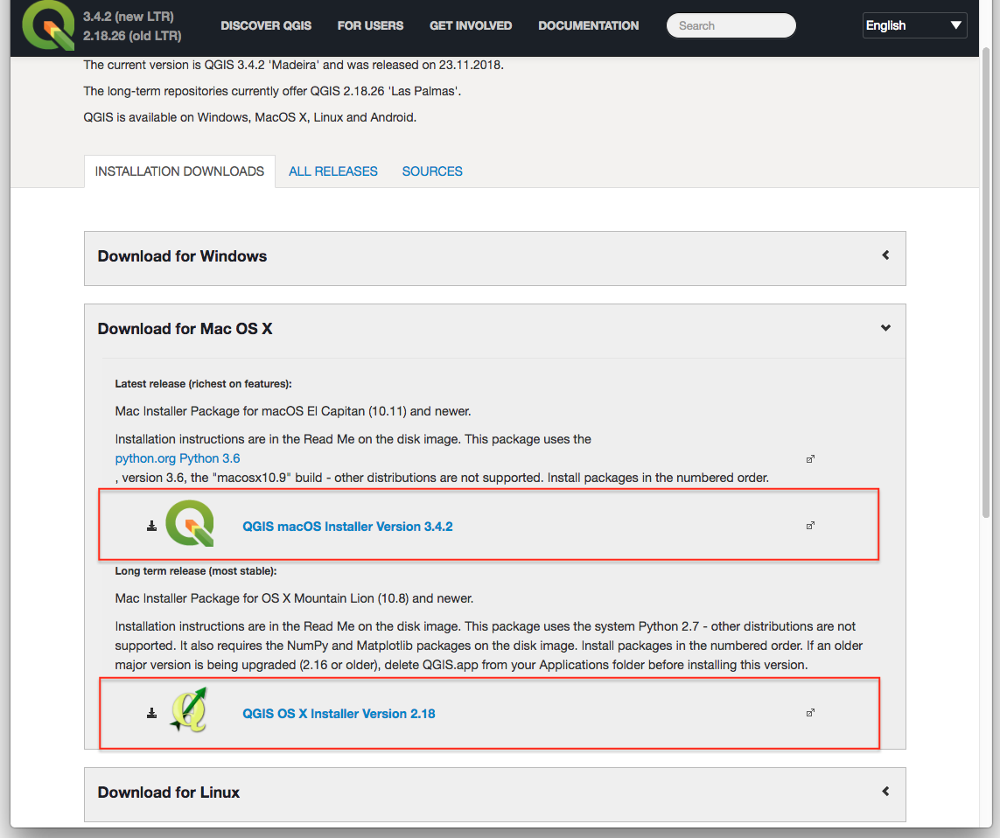
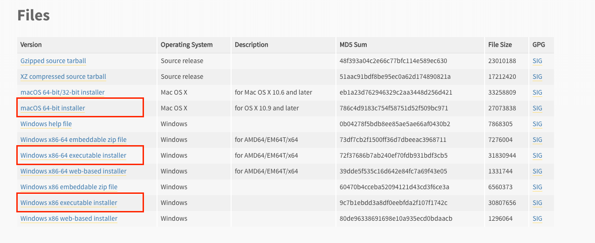
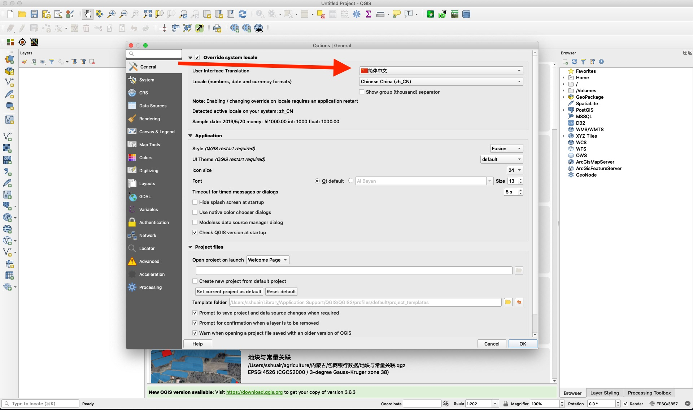
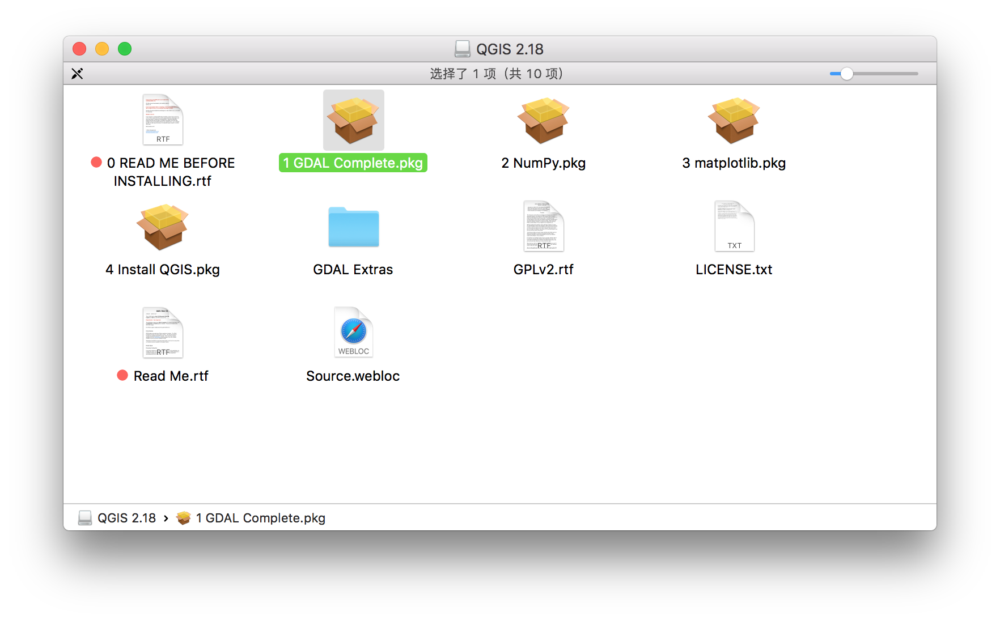
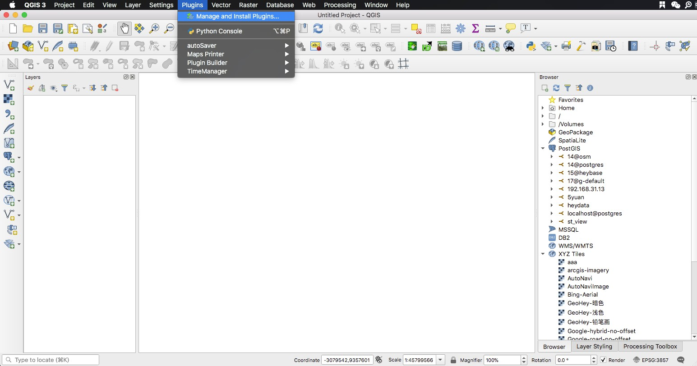
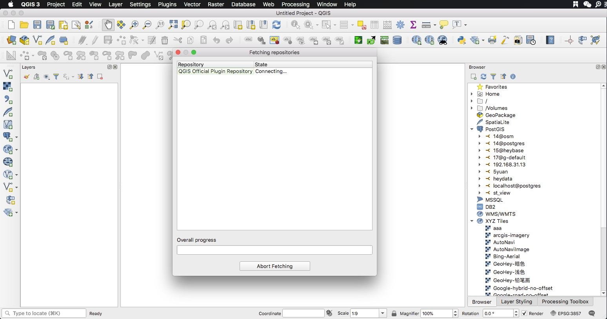
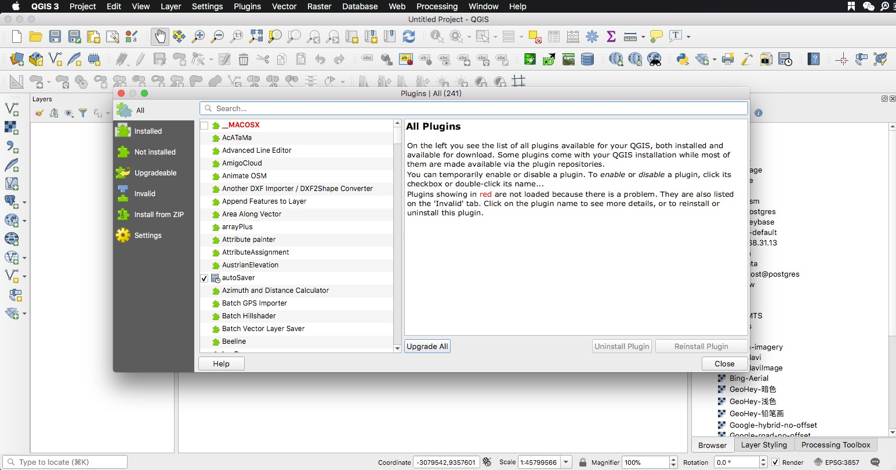
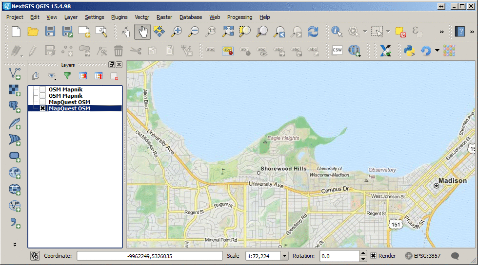
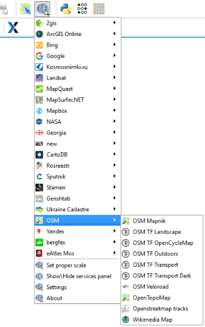
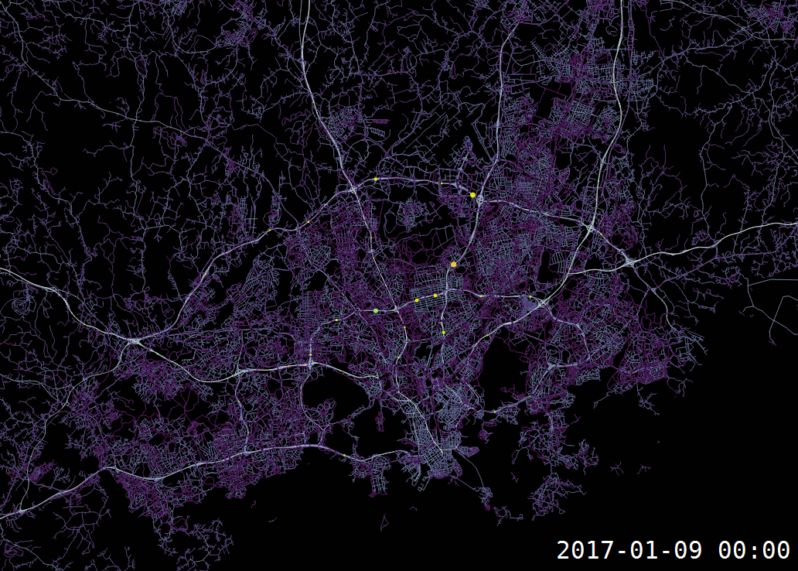

## QGIS
[QGIS](https://www.qgis.org/en/site/index.html)是一个开源的地理数据处理、分析、制图工具，可以免费获取和使用，支持Window、MacOS、Linux三大主流操作系统。
### QGIS 安装
QGIS目前有两个重大版本，分别是`QGIS 2`和`QGIS3 `，其中QGIS2是老版本，稳定，插件较多，QGIS 3是目前最新的版本，技术体系升级界面更美观，但是稳定性不如2系列。

**QGIS 下载链接**: https://www.qgis.org/en/site/forusers/download.html

这里推荐大家下载最新版本的QGIS，也就是 QGIS 3.6

## Windows安装
Windows的用户可以按照自己的系统下载对于版本，如图所示

1. 安装前需要将360等杀毒软件完全退出，因为QGIS要写一些配置文件到系统环境变量中，360会误识别为木马；
2. 安装路径中不能有中文，默认装到C盘路径下即可；
3. 安装完成后，在开始菜单中检查是否有`QGIS Desktop`，这个就是QGIS软件；

## MacOS安装

### QGIS3安装(MacOS)
MacOS的用户在安装QGIS3前，需要先安装依赖[Python3.6](https://www.python.org/downloads/release/python-368/)，注意python3.7不可以，一定是Python3.6。

安装完python3.6之后就可以安装QGIS了。

QGIS3 安装好之后，可在菜单栏`settings`-->`Options`中将界面改成中文，然后重启QGIS3即可。

### QGIS2安装(MacOS)
QGIS2系列不需要先安装python，直接打开安装包，然后按照
- `1 GDAL Compelete.pkg`  
- `2 NumPy.pkg`  
- `3 matplotlib.pkg`  
- `4 Install QGIS.pkg` 
  
顺序，依次按照即可。

QGIS2 安装好之后，可在菜单栏`settings`-->`Options`中将界面改成中文，然后重启QGIS3即可。

## QGIS插件
QGIS拥有众多的第三方插件，可以方便我们做各种各样的制图、编辑、分析等工作，如果QGIS自带的工具中，没有能够满足需求的可以先到QGIS的插件库中去寻找。

### 插件安装
1. 在QGIS的菜单，选择`Plugins`-->`Manage and Install Plugins..`

第一次打开的时候会比较慢，因为要从网络上加载插件列表，耐心等待...

2. 加载完毕后，可以看到在`All`中包含了非常多的可用插件，选中你想要安装的插件，点击右下角的`Install Plugin`即可；`installed`里面是目前已经安装的插件，

### 常用插件介绍
#### 1. QuickMapServices
加载各种互联网和专题产品数据，比如高德、GoogleMap、NASA等等。

#### 2. TimeManager
制作动态地图

