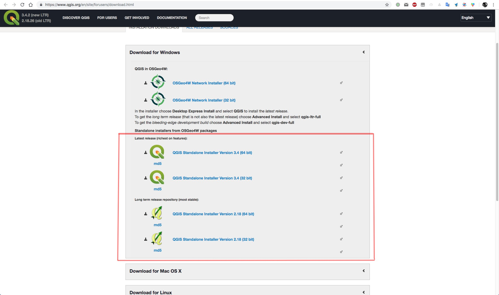

## QGIS
[QGIS](https://www.qgis.org/en/site/index.html)是一个开源的地理数据处理、分析、制图工具，可以免费获取和使用，支持Window、MacOS、Linux三大主流操作系统。
### QGIS 安装
QGIS目前有两个重大版本，分别是`QGIS2`和`QGIS3`，其中QGIS2是老版本，稳定，插件较多，QGIS3是目前最新的版本，技术体系升级界面更美观，但是相对稳定性不如2系列，并且MacOS用户安装较为困难。

**QGIS 下载链接**: https://www.qgis.org/en/site/forusers/download.html

这里推荐大家下载最新版本的QGIS，也就是QGIS3.4

>注：QGIS3.4 依赖python3.6，因此需要先安装python3.6才能使用，MacOS的用户安装可能较为复杂，如果不愿意折腾，推荐QGIS2.18；Windows的用户推荐QGIS3.4

## QGIS插件
QGIS拥有众多的第三方插件，可以方便我们做各种各样的制图、编辑、分析等工作，如果QGIS自带的工具中，没有能够满足需求的可以先到QGIS的插件库中去寻找。

### 插件安装
1. 在QGIS的菜单，选择`Plugins`-->`Manage and Install Plugins..`

第一次打开的时候会比较慢，因为要从网络上加载插件列表，耐心等待...

2. 加载完毕后，可以看到在`All`中包含了非常多的可用插件，选中你想要安装的插件，点击右下角的`Install Plugin`即可；`installed`里面是目前已经安装的插件，

### 常用插件介绍
#### 1. QuickMapServices
加载各种互联网和专题产品数据，比如高德、GoogleMap、NASA等等。

#### 2. TimeManager
制作动态地图

