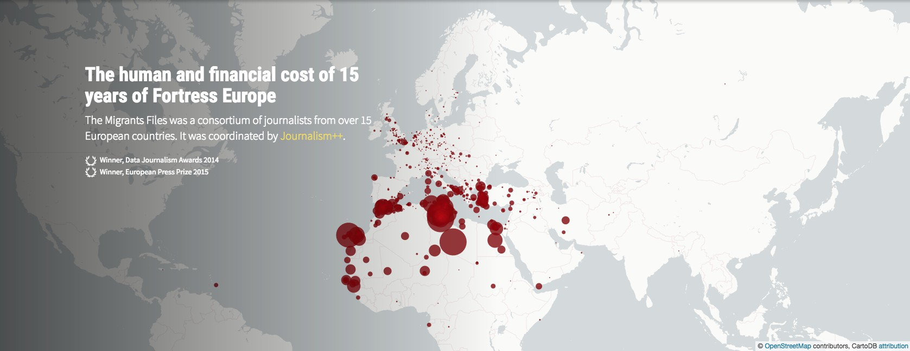

这个实战教程，我们会尝试用QGIS去复现[The Migrants’ Files: Surveying ­migrants’ deaths at Europe’s door](http://www.themigrantsfiles.com/)中的一幅图。该作品获得2014年[DATA JOURNALISM AWARDS](https://www.datajournalismawards.org/past-winners/)和2015年[European Press Prize](https://www.europeanpressprize.com/shortlists/year-2015/)两个大奖。





## 颜色配置：
### 1. migrants file图层
1. 渲染方式：渐进样式
2. 渐进字段（列）：deaths
3. 显示方法：size
4. size from：1~18
5. 分段数量：25
6. 分段方法：手动分段
```

```
7. 颜色填充：#850200
8. 轮廓：无填充

## 2. world country图层
1. 渲染方式：单一符号
2. 填充样式：
    - 颜色：#fafaf8
    - 轮廓：#bdaeaf