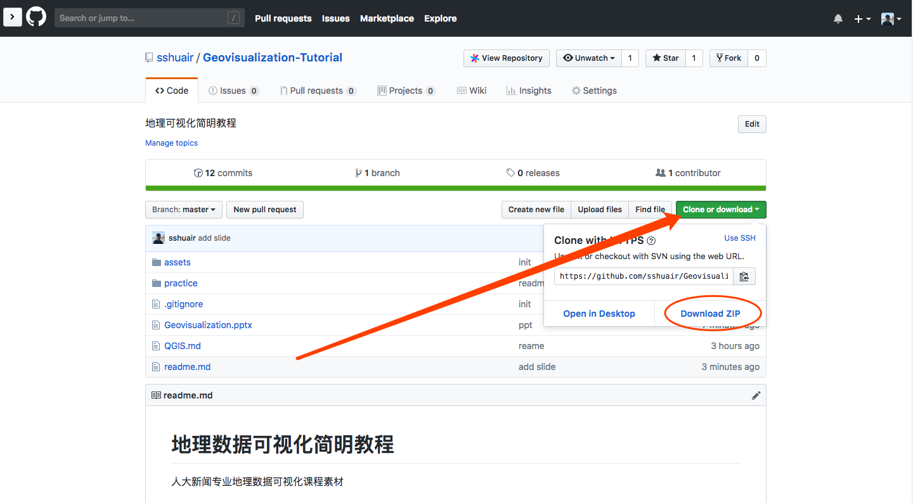

# 地理数据可视化简明教程（持续更新...）

人大新闻专业地理数据可视化课程素材

## 内容大纲
1. 地理数据
2. 地理数据可视化基本方法
3. 地图投影
4. 地图注意事项（边界政治问题）
5. 案例实践

## 课程素材
1. 幻灯片：[Geovisualization.pptx](./Geovisualization.pptx)
2. 课程软件：
    - QGIS: [安装教程](./QGIS-install.md)
3. 实践素材
    - 实践一：[2016年美国大选地图](./practice/practice-01-美国大选)
    - 实践二：[2014年DJA获奖作品:MigrantsFiles](./practice/practice-02-MigrantsFiles)

## 如何下载

如果下载速度较慢，可以到百度云盘下载: https://pan.baidu.com/s/1Dq9KJOZjf9Oq0lccnbeYmg 提取码: 6wtc 

## Q&A
- 如果大家在学习的过程中，有任何困难或者不明白的地方，可以到[issues](https://github.com/sshuair/Geovisualization-Tutorial/issues)中提问，我会尽自己所知为大家解答，知道的同学也可以帮着回答。
- 同时也欢迎大家为教程做贡献，可以提交[Pull requests](https://github.com/sshuair/Geovisualization-Tutorial/pulls)贡献内容。